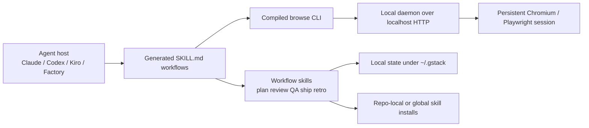
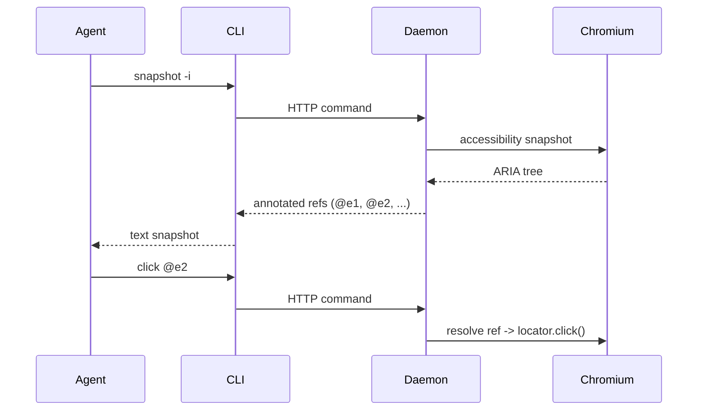

# gstack architecture

## High-level structure

## Runtime model

The core architecture is split into two major planes:

### 1. Workflow skill plane

This is mostly Markdown + generation logic.

- skill files describe specialist roles and workflows
- templates are expanded into generated `SKILL.md` artifacts
- host-specific output is produced for Claude/Codex/etc.
- setup logic installs or links the generated skills into expected host locations

### 2. Browser execution plane

This is the real technical engine.

- a compiled CLI binary is invoked by the agent
- the CLI talks to a long-lived local HTTP daemon
- the daemon manages persistent Chromium state
- Playwright is used underneath for real browser automation
- refs (`@e1`, `@c1`) bridge agent instructions to actual page elements

## Key components

### Repository/documentation layer

Important root files:

- `README.md` — product framing, quick start, workflow philosophy
- `ARCHITECTURE.md` — rationale and internal design
- `AGENTS.md` — host-facing agent/skill summary
- `SKILL.md` + `SKILL.md.tmpl` — generated-skill strategy
- `BROWSER.md` — browser command reference
- `CONTRIBUTING.md` — contributor flow
- `CHANGELOG.md` / `VERSION` — release/version tracking

### Directory shape observed at root

Representative areas from the analyzed tree:

- `browse/` — browser CLI/server runtime
- `bin/` — helper binaries and config tools
- `scripts/` — generation and tooling scripts
- `docs/` — long-form skill documentation
- many skill directories such as:
  - `office-hours`
  - `review`
  - `qa`
  - `ship`
  - `benchmark`
  - `investigate`
  - `setup-browser-cookies`
  - `careful` / `freeze` / `guard`
  - `autoplan`
  - `codex`
  - `cso`

This repo shape is itself the product: each directory is effectively a specialized skill or support subsystem.

## Build and packaging

From `package.json` and `setup`:

- package manager/runtime: **Bun**
- main build command compiles browser/design binaries and regenerates docs
- build output includes a version stamp from `git rev-parse HEAD`
- `setup` is the real installer/orchestrator and handles:
  - dependency presence checks
  - Bun install/build
  - Playwright/Chromium verification
  - host detection
  - linking/generated-skill placement
  - prefix / namespace preferences

## Browser subsystem details

### Design goal

The browser path is explicitly optimized for:

- **persistent state**
- **sub-second repeated commands**
- **real authenticated browsing**

### Core mechanics

From `ARCHITECTURE.md`:

- local daemon binds to `localhost`
- session state stored in `.gstack/browse.json`
- auth uses per-session bearer token in the state file
- Chromium process persists across commands
- browser auto-starts on first use and auto-shuts down after idle timeout
- version mismatch triggers auto-restart of stale daemons

### Ref model

The repo uses accessibility-tree snapshots to assign stable-ish refs to elements.

This is a pragmatic and well-thought-out approach to agent/browser interaction.

## Security posture

Security choices are coherent for a local single-user tool:

- localhost-only binding
- bearer token on the local daemon
- owner-only state file permissions
- in-memory cookie decryption/loading
- read-only access pattern for copied cookie DBs
- explicit user approval via OS keychain prompts
- actionable error rewriting instead of raw stack traces

This is good local-tooling hygiene, but it is **not** a cloud multi-tenant security model.

## Testing and eval strategy

gstack’s test strategy is notably mature.

### Tiering

- **Tier 1:** static validation / unit tests
- **Tier 2:** E2E session tests via `claude -p`
- **Tier 3:** LLM-as-judge evaluation

### Observability

The architecture docs describe:

- heartbeat files
- partial eval persistence
- run directories under local state
- machine-readable exit reasons
- dashboard/watch tooling

This is valuable because it treats agent evaluation as an engineering system, not just a one-off test script.

## Architectural strengths

1. **Excellent local ergonomics**
2. **Strong anti-drift discipline between code and skill docs**
3. **Clear role/process separation**
4. **Thoughtful persistent browser design**
5. **Testing/eval model is far better than average for agent tooling**

## Architectural constraints

1. **Localhost and local filesystem are hard dependencies**
2. **Persistent user browser state is a feature, but also a portability limit**
3. **Single-user orientation is explicit**
4. **Host-specific generated skill ecosystems create integration complexity**
5. **Not designed as a remote service, bot, or shared orchestrator**

## Architecture verdict

As a **local operator-side AI workflow system**, gstack is impressive and internally coherent.

As a **direct architectural substrate for HelkinSwarm**, it is mismatched.

The strongest reuse path is not code transplantation; it is **pattern extraction**:

- browser daemon concepts for local helper tooling
- skill generation/documentation discipline
- eval/observability patterns
- explicit role sequencing for multi-step delivery work
