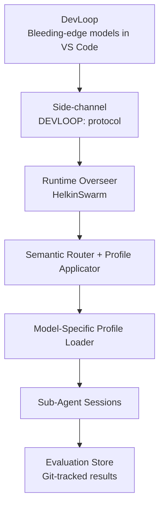

# HelkinSwarm Project Specification

## 0b. Model-Specific Tool Presentation and Self-Tuning Evaluation Loop

**Feature Specification**  
**Version:** 1.0 (Unchained Edition)  
**Date:** March 2026  
**Status:** Draft – Ready for DevLoop implementation

### 1. Overview

This feature defines a **closed-loop, self-evolving agentic framework** that allows HelkinSwarm to automatically discover, test, and optimize how tools are presented to each model.

The runtime uses **global frontier models by default** (Grok, GPT, etc.) for maximum performance. EU DataZoneStandard residency is available as a configurable toggle (`euResidencyMode`). The DevLoop side (VS Code + GitHub Copilot Chat) has access to bleeding-edge models for evaluation and tuning.

The core innovation is an **intelligent abstraction layer** (“model profiles”) that presents tools to each model in the exact format, depth, and style it performs best with — avoiding overload, hallucinations, or suboptimal performance.

A dedicated **side-channel** (DEVLOOP: protocol) allows DevLoop to directly interrogate the live runtime, run benchmarks, and auto-tune these profiles without going through the end-user chat surface.

### 2. Goals

- Never force a lowest-common-denominator tool interface across models.  
- Continuously discover, validate, and version the optimal tool-presentation strategy per model.  
- Make the system future-proof: when new models become available (global or EU), the same pipeline automatically re-optimizes.  
- Keep everything versioned in Git, reproducible, and observable.  
- Zero human setup — the agents themselves drive the tuning loop.

### 3. High-Level Architecture



**Key Components**
- **Model Profiles** – JSON files that define per-model tool presentation (style, max tools, naming, examples, progressive reveal, known limitations).
- **Profile Store** – Stored in `model-profiles/` and committed to the repo.
- **Eval Store** – Git-tracked JSON + charts containing benchmark scores and logs.
- **Side-Channel** – DEVLOOP: prefixed messages routed directly to the orchestrator with elevated context.

### 4. Model Profile Format (v1)

```json
{
  "model": "grok-4-1-fast-reasoning",
  "version": "2026-03-12",
  "presentation": "flat_json" | "progressive" | "mcp" | "cli_mimic",
  "max_tools_per_turn": 12,
  "progressive_reveal": true,
  "schema_injection": "on_first_mention",
  "preferred_naming": "snake_case_with_domain_prefix",
  "examples": [ ... ],
  "known_limitations": [ ... ]
}
```

Profiles live in `model-profiles/<model-id>/` and are versioned.

### 5. Self-Tuning Evaluation Loop (DevLoop → Runtime)

**Trigger conditions**
- New model becomes available (global or EU)
- Toolset changes (new capabilities or SkillForge merge)
- Manual `DEVLOOP: re-eval` command
- Scheduled run (future)
- CI/CD hook on profile or capability change

**Workflow**
1. **Discovery** — DevLoop sends `DEVLOOP: probe_limits model=xxx tools=full-set`. Runtime self-reports.
2. **Hypothesis Generation** — DevLoop creates 3–5 candidate profiles.
3. **Benchmarking** — Run synthetic + real tasks across all models. Capture success rate, latency, token efficiency, safety, and verification pass rate.
4. **Scoring & Promotion** — Weighted score selects winner. Winning profile is committed and becomes active.
5. **Regression Guard** — If score drops ≥10% on future runs, auto-rollback + alert.

### 6. Delivery Methods

- **Primary** — DevLoop harness (VS Code + Teams Test Harness MCP) for interactive tuning.
- **Future** — Headless GitHub Actions or Azure-native Agent Service when available.

### 7. Success Metrics

- ≥90% success rate on internal benchmark suite for every model.
- Profile updates happen autonomously ≥95% of the time.
- Zero manual profile editing after initial setup.
- Regression alerts <2 per quarter.
