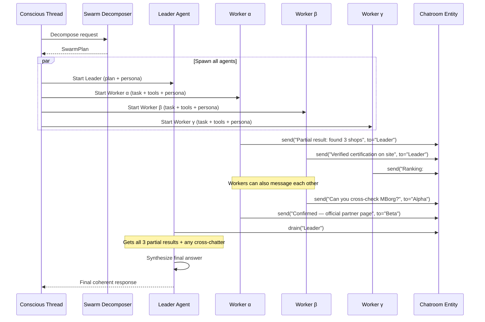

# HelkinSwarm Project Specification

## 0ze. Intra-Session Swarm Architecture and Chatroom Protocol

**Spec ref:** `docs/08-Orchestrator-Patterns.md`, `docs/0z-Living-Mind-Architecture-Temporal-Consciousness-and-Single-Session-Orchestration.md`, `docs/0zc-Sub-Session-Autonomic-Functions-and-Model-Capacity-Framework.md`, `docs/0j-Virtual-Employees-and-Nested-Orchestrators.md`, `docs/06-Tool-Dispatch-LLM-Layer.md`, `docs/0zi-Swarm-Memory-Architecture-Three-Tier-RAG-and-Cross-Agent-Reasoning.md` (memory layer)

**Status:** Major Architectural Evolution — Next Engineering Wave  
**Owner:** Principal Developer  
**Last Updated:** 2026-04-12

---

### 1. Purpose & Vision

HelkinSwarm's current execution model is fundamentally **sequential**: one conscious thread processes a user message, dispatches tools one at a time (or in small parallel batches via the planner), and synthesizes a single response. Sub-agents are **instrumental** — they execute a scoped task and return, never collaborating with each other.

This design doc introduces **Intra-Session Swarm Execution** — a new architectural layer where the Conscious Thread (the Overseer's turn) decomposes a task and spawns **N specialized parallel agents** that:

- Execute simultaneously on different aspects of the problem
- Communicate with each other in real-time via a **chatroom protocol**
- Share partial results, cross-verify findings, and build consensus
- Converge their outputs back to a **Leader agent** for final synthesis

This is **not** the Virtual Employee pattern (0j) — those are full nested orchestrators with their own Cosmos partitions and lifecycle. This is a **within-turn collaborative swarm** that lives and dies within a single session sub-orchestrator invocation. It is the natural evolution of the existing sub-agent pattern into something dramatically more capable.

**The analogy**: If the current sub-agent pattern is "asking one specialist a question and waiting for the answer," the intra-session swarm is "convening a war room of specialists who work simultaneously, talk to each other, and hand the Leader a fully cross-verified briefing."

**Inspiration source**: The Grok 4.1 multi-agent swarm architecture (Grok + Benjamin + Harper + Lucas) demonstrates that four parallel instances of the same reasoning model, each given a specialized persona and connected via a real-time chatroom, produce dramatically higher quality results than a single sequential LLM — even when the underlying model is identical. The secret is **parallel discovery + instant inter-agent messaging + cross-verification before synthesis**.

---

### 2. Relationship to Existing Architecture

This pattern must coexist cleanly with every existing architectural contract.

| Existing Contract | Impact | Compatibility |
|---|---|---|
| **Single-Session Continuity (0z §2.1)** | Swarm agents are **Instrumental Sub-Sessions**, not Conscious Threads. The single Conscious Thread spawns them and collects their output. | ✅ Fully compatible — extends the autonomic function carve-out from 0zc §2 |
| **Living Mind Contract (0z)** | The swarm is an internal cognitive process of the Conscious Thread, analogous to the brain's parallel cortical columns converging on a single perception | ✅ No violation — one mind, parallel processing |
| **Limbic System (0zd)** | All inbound triggers still flow through LimbicIngress. The swarm is an execution strategy chosen *after* the Limbic System admits the turn | ✅ Limbic remains sole gatekeeper |
| **Sub-Agent Isolation (06 §Sub-Agent Isolation)** | Swarm agents get isolated LLM contexts just like current sub-agents. The chatroom adds a controlled communication channel between them — but never shared history with the Conscious Thread | ✅ Isolation preserved; chatroom is explicit, auditable |
| **Safety Pipeline (0e)** | All tool calls from any swarm agent still route through `isAllowedBySafetyMode()` and the verification pipeline | ✅ No safety bypass |
| **Planner (08 §Session Sub-Orchestrator)** | The planner decides *whether to use swarm execution* for a given turn. Simple requests skip it entirely (zero overhead). Complex requests that benefit from parallel research trigger swarm decomposition | ✅ Planner remains the decision point |
| **Virtual Employees (0j)** | Virtual Employees are long-lived nested orchestrators. Swarm agents are ephemeral within-turn workers. They are complementary, not competing | ✅ Separate layers |

**Architectural Position**:

```
Sequential Sub-Agent (current)
    ↓ evolution
Intra-Session Swarm (this doc)        ← NEW LAYER
    ↓ evolution
Virtual Employees (0j, post-MVP)
```

---

### 3. Core Architecture

#### 3.1 Swarm Components

```mermaid
graph TD
    U[User Message] --> L[Limbic Ingress]
    L --> CT[Conscious Thread<br/>Session Sub-Orchestrator]
    CT --> P[Planner Activity]
    P -->|simple request| SEQ[Sequential Sub-Agent<br/>(existing pattern)]
    P -->|swarm-eligible request| SD[Swarm Decomposer Activity]
    SD --> LEADER[Leader Agent<br/>Coordinates + Synthesizes]
    SD --> W1[Worker Agent α<br/>Research Specialist]
    SD --> W2[Worker Agent β<br/>Deep Browse Specialist]
    SD --> W3[Worker Agent γ<br/>Synthesis & Ranking]
    W1 <-->|chatroom_send| CR[Chatroom<br/>In-Memory Message Bus]
    W2 <-->|chatroom_send| CR
    W3 <-->|chatroom_send| CR
    LEADER <-->|chatroom_send| CR
    LEADER --> SYN[Final Synthesis]
    SYN --> CT
    style CT fill:#1e3a8a,stroke:#60a5fa
    style CR fill:#7c3aed,stroke:#a78bfa
    style LEADER fill:#065f46,stroke:#34d399
```

#### 3.2 Component Definitions

| Component | Responsibility | Lifecycle |
|---|---|---|
| **Swarm Decomposer Activity** | Analyzes the request, decides how many agents and what specializations. Produces a `SwarmPlan` | Single deterministic activity call |
| **Leader Agent** | Receives the `SwarmPlan`, delegates via chatroom, collects partial results, performs final synthesis into a single coherent response | Durable activity with timeout |
| **Worker Agent (α, β, γ, …)** | Executes a specialized slice of the task using its assigned tools and persona. Communicates results back to Leader and optionally to other Workers | Parallel Durable activities |
| **Chatroom** | In-memory message bus that routes `chatroom_send` calls between agents within the swarm | Lives for the duration of the swarm turn; destroyed after synthesis |

#### 3.3 The Chatroom Protocol

The chatroom is the **sole inter-agent communication primitive**. It is deliberately simple.

**Message Schema:**

```typescript
// src/orchestrator/swarm/chatroomMessage.ts
import { z } from "zod";

export const ChatroomMessageSchema = z.object({
  from: z.string(),                          // agent name ("Leader", "Alpha", etc.)
  to: z.union([                              // recipient(s)
    z.string(),                              // single agent name or "All"
    z.array(z.string()),                     // multiple agent names
  ]),
  message: z.string(),                       // content (partial results, questions, votes, etc.)
  timestamp: z.number(),                     // Date.now()
  correlationId: z.string(),                 // swarm-level correlation for observability
});

export type ChatroomMessage = z.infer<typeof ChatroomMessageSchema>;
```

**Delivery Semantics:**

The chatroom has **two delivery modes** that make collaboration feel alive:

| Mode | Condition | Behavior |
|---|---|---|
| **Thinking Injection** | Recipient is between tool calls (reasoning phase) | Message injected as a new context turn: `[From Alpha] Rocky Mountain confirmed as FOX partner…` |
| **Tool-Response Append** | Recipient is currently waiting for a tool result | Message appended to the tool response, so the agent sees both tool output and teammate message together |

**Confirmed by Grok team (April 2026)**: LLM inference calls are **atomic** — there is no mid-stream token injection during an in-flight generation. Messages are queued and delivered on the **next inference turn** as a new function turn in context. If a message arrives while a tool is executing, it is appended to the tool response. In practice, within HelkinSwarm's Durable Functions architecture, both modes resolve to the same mechanism: messages are queued and the agent's next LLM prompt includes all accumulated chatroom messages since the last call. This is a clean fit for our atomic-activity execution modew function turn in context. If a message arrives while a tool is executing, it is appended to the tool response. In practice, within HelkinSwarm's Durable Functions architecture, both modes resolve to the same mechanism: messages are queued and the agent's next LLM prompt includes all accumulated chatroom messages since the last call. This is a clean fit for our atomic-activity execution model.

**Implementation Mapping to Durable Functions:**

```typescript
// Conceptual — the Chatroom lives as shared state across parallel activities
interface SwarmChatroom {
  send(from: string, message: string, to: string | string[]): void;
  getMessages(agentName: string): ChatroomMessage[];     // drain queue for this agent
  getTranscript(): ChatroomMessage[];                      // full audit log
}
```

Because Durable Functions activities are isolated (no shared memory), the chatroom is implemented as a **Durable Entity** (`SwarmChatroomEntity`) that all agents interact with via entity signals:

```typescript
// src/orchestrator/swarm/swarmChatroomEntity.ts
import * as df from "durable-functions";

const swarmChatroomEntity = df.app.entity("SwarmChatroom", (ctx) => {
  const state = ctx.df.getState<SwarmChatroomState>() ?? {
    queues: {},
    transcript: [],
  };

  switch (ctx.df.operationName) {
    case "send": {
      const msg: ChatroomMessage = ctx.df.getInput();
      state.transcript.push(msg);
      const recipients = msg.to === "All"
        ? Object.keys(state.queues)
        : Array.isArray(msg.to) ? msg.to : [msg.to];
      for (const r of recipients) {
        (state.queues[r] ??= []).push(msg);
      }
      break;
    }
    case "drain": {
      const agentName: string = ctx.df.getInput();
      const messages = state.queues[agentName] ?? [];
      state.queues[agentName] = [];
      ctx.df.return(messages);
      break;
    }
    case "transcript": {
      ctx.df.return(state.transcript);
      break;
    }
  }

  ctx.df.setState(state);
});
```

Each worker agent, after completing a tool call, calls `entity.drain(myName)` to collect any messages that arrived while it was working, then incorporates them into its next reasoning step.

---

### 4. Swarm Execution Lifecycle

#### 4.1 Decision to Swarm

**Confirmed by Grok team**: In the Grok swarm, the swarm-vs-sequential decision is part of the Leader's **first inference turn** — not a separate LLM call or classifier. The Leader's system prompt contains the routing logic: "If the query is complex/research-heavy/multi-faceted, delegate to the swarm; otherwise handle sequentially."

For HelkinSwarm, we implement this as part of the existing **planner activity** (Session Sub-Orchestrator). The planner already classifies request complexity — we add a `"swarm-eligible"` branch alongside the existing `"simple"` and `"complex"` paths. The decision signals are:

| Signal | Threshold | Example |
|---|---|---|
| **Query complexity class** | `complex` (from existing structural classifier per #324) | "Find the best suspension shop in Munich certified by FOX, with pricing, reviews, and alternatives" |
| **Estimated parallelizable sub-tasks** | ≥ 2 independent information needs | Research + verification + ranking = 3 parallel tracks |
| **Available tool diversity** | Request touches ≥ 2 distinct skill domains | web_search + browse_page + memory retrieval |
| **User urgency signal** | High urgency benefits from parallel speedup | "Quick — find me…" |

**Simple or single-tool requests always skip swarm execution.** The overhead is only justified when parallel work genuinely improves quality or speed.

#### 4.2 Swarm Decomposition

The `SwarmDecomposerActivity` produces a `SwarmPlan`:

```typescript
// src/orchestrator/swarm/swarmPlan.ts
import { z } from "zod";

export const SwarmAgentRoleSchema = z.object({
  name: z.string(),                             // "Alpha", "Beta", "Gamma"
  persona: z.string(),                          // system prompt for this agent
  specialization: z.enum([
    "research",                                 // broad web/data searches
    "deep_browse",                              // precise page extraction, verification
    "synthesis",                                // ranking, comparison, code execution
    "domain_expert",                            // skill-specific deep knowledge
  ]),
  assignedTools: z.array(z.string()),           // subset of available tools
  task: z.string(),                             // specific subtask description
});

export const SwarmPlanSchema = z.object({
  correlationId: z.string(),
  strategy: z.string(),                         // human-readable decomposition rationale
  leader: z.object({
    persona: z.string(),                        // leader's synthesis persona
    synthesisInstructions: z.string(),           // how to merge results
  }),
  agents: z.array(SwarmAgentRoleSchema).min(2).max(6),
  timeoutMs: z.number().default(30_000),        // max wall-clock for entire swarm
  consensusRequired: z.boolean().default(false), // require all agents to agree before synthesis
});

export type SwarmPlan = z.infer<typeof SwarmPlanSchema>;
```

The decomposer uses the **fast reasoning model** (primary lane) to produce this plan. It sees the user's query, available tools, and active skill manifests. This is a single LLM call with a structured output schema.

#### 4.3 Parallel Execution



**Key execution rules:**

1. **All worker agents start in parallel** — no sequential dependency between workers by default.
2. **Workers can message the Leader** to push partial results at any time.
3. **Workers can message each other** for cross-verification or follow-up questions.
4. **The Leader monitors the chatroom** and can:
   - Send delegation messages to workers ("Also check the mobile option")
   - Send broadcast status ("Enough data, wrap up")
   - Request additional work from specific workers
5. **Timeout enforcement**: If any worker hasn't reported within `timeoutMs`, the Leader synthesizes from whatever partial results are available. No hanging.
6. **Leader synthesis is opportunistic**: Confirmed by Grok team — the Leader does NOT wait for all workers to explicitly signal completion. It synthesizes as soon as it has "enough" verified data from the chatroom. Workers that haven't reported are simply absent from the synthesis (the Leader notes partial data if needed). The `wait` tool is available for stricter synchronization when needed, but the default is opportunistic.
7. **Graceful degradation on worker failure**: If one worker fails (tool timeout, empty results, hallucination), other agents continue unaffected. The Leader synthesizes from available data. Cross-verification by other agents catches hallucinations. No automatic retry/replace — the Leader can manually re-delegate if it detects a gap.
8. **The Conscious Thread waits** for the Leader's final output, then continues the normal session flow (safety pipeline, reply activity, etc.).

#### 4.4 Agent Execution Loop (Each Worker)

Each worker agent runs a tight loop:

```
1. Receive task + persona + assigned tools
2. Call LLM with task context
3. If LLM returns tool_calls → execute tool(s) through safety pipeline
4. Drain chatroom for new messages from teammates
5. If new messages change the picture → inject them and re-reason
6. Send partial results to Leader (and optionally other workers)
**Model selection note**: The Grok 4.1 swarm runs **all four agents on the same high-capacity model** with identical inference parameters (temperature 0.7, top_p 0.95, max_tokens ~16k). Specialization comes entirely from the system prompt, not model variance. For HelkinSwarm, the default is the **primary model** for all swarm agents (swarm execution is only triggered for complex queries where quality justifies 4× cost). A secondary-model fallback is available via SwarmPlan override for budget-constrained turns
8. Send final results to Leader and exit
```

**Model selection note**: The Grok 4.1 swarm runs **all four agents on the same high-capacity model** with identical inference parameters (temperature 0.7, top_p 0.95, max_tokens ~16k). Specialization comes entirely from the system prompt, not model variance. For HelkinSwarm, the default is the **primary model** for all swarm agents (swarm execution is only triggered for complex queries where quality justifies 4× cost). A secondary-model fallback is available via SwarmPlan override for budget-constrained turns.

---

### 5. Agent Specialization Framework

#### 5.1 Standard Agent Archetypes

Every swarm spawns a **Leader** plus 2–6 **Workers** drawn from these archetypes. The decomposer selects and customizes them per query.

| Archetype | Persona Core | Default Tools | Strength |
|---|---|---|---|
| **Research Specialist** | Fast, broad searches. Find official sources, addresses, facts. Cross-check across multiple results. Skeptical. | `web_search`, `helkin_skill_search`, memory recall | Discovery & verification |
| **Deep Browse Specialist** | Surgical precision with page extraction. Craft perfect browse instructions. Extract exact quotes, data points, structured information. | `browse_page`, `web_search` (targeted), image tools | Evidence extraction |
| **Synthesis & Ranking Specialist** | Practical, user-focused. Build comparison tables. Rank by user-relevant criteria. Add alternative options and practical tips. | `code_execution` (if available), memory, calculation | Convergence & UX |
| **Domain Expert** | Deep knowledge of a specific skill domain (Outlook, GitHub, Azure, etc.). Applies domain-specific patterns and best practices. | Domain-specific skill tools | Specialist execution |

#### 5.2 Leader Persona

The Leader is **not** a general-purpose agent. It has a specific, bounded role:

```markdown
You are the Swarm Leader for this turn.
Your job is to:
- Coordinate specialist workers via chatroom_send.
- Collect and cross-verify partial results from all workers.
- Synthesize a single, coherent, high-quality final answer.
- Use citations and structured formatting.
- Only output the final response when you have enough verified data
  or the timeout forces synthesis.
- Never do deep research or tool calls yourself — delegate everything.
- If a worker reports contradictory data, ask another worker to verify.
```

#### 5.3 Dynamic Persona Generation

Agent personas are **not hardcoded**. The Swarm Decomposer generates custom persona strings tailored to the specific query. The archetypes above are templates; the decomposer fills in query-specific instructions:

```json
{
  "name": "Alpha",
  "specialization": "research",
  "persona": "You are Alpha, the Research Specialist. Your task: find FOX-authorized suspension service shops within 30km of Munich city center. Search in BOTH English and German ('Fox Gabelservice München'). Prioritize official partner listings over generic directories. Send each confirmed shop (name + address + certification evidence) to Leader immediately.",
  "assignedTools": ["web_search"],
  "task": "Find certified FOX suspension service shops near Munich"
}
```

This task-specific specialization is what makes the swarm dramatically more focused than a single agent trying to do everything.

---

### 6. Parallelism and Tool Execution

#### 6.1 Parallel Tool Calls Within a Worker

Each worker can fire **multiple tool calls in parallel** within a single LLM response (this is the existing parallel tool_calls behavior from the function-calling spec). The swarm adds a second level of parallelism: **multiple workers running simultaneously**.

**Two levels of parallelism:**

```
Level 1: Multiple workers executing in parallel (swarm-level)
  ├── Worker α: web_search("FOX Munich") + web_search("Fox Gabelservice")    ← Level 2: parallel tool calls within worker
  ├── Worker β: browse_page(shop1) + browse_page(shop2)                      ← Level 2
  └── Worker γ: waiting for partial results (synthesis role)
```

#### 6.2 Tool Safety in Swarm Context

All existing safety guarantees apply to every tool call from every agent:

- `isAllowedBySafetyMode()` check per call
- Scoped token minting per call
- Verification pipeline for destructive actions
- The Leader cannot bypass safety by delegating to a worker

**Additional swarm-specific safety rule**: Workers are restricted to the `assignedTools` in their `SwarmAgentRole`. They cannot call tools outside their assignment, even if the LLM attempts to. This is enforced at the dispatch layer.

#### 6.3 Cost and Token Budget Management

Swarm execution is **more expensive** than sequential — N agents × M tool calls × LLM tokens. Controls:
(Grok swarm has no hard cap — agents loop until done. We add the cap as a safety control for cost management) 
| Control | Mechanism |
|---|---|
| **Max agents per swarm** | Hard cap: 6 workers + 1 leader |
| **Max rounds per worker** | Hard cap: 4 LLM call rounds per worker (Grok swarm has no hard cap — agents loop until done. We add the cap as a safety control for cost management) |
| **Global token budget** | Swarm consumes from the session's token budget. If approaching 80% threshold, the Conscious Thread can signal early wrap-up |
| **Timeout** | Wall-clock timeout per SwarmPlan (default 30s) |
| **Complexity gate** | Planner only triggers swarm for `complex` classified requests |
| **Model selection** | Workers default to secondary (cheaper) model unless explicitly overridden |

---

### 7. Cross-Verification and Consensus

One of the most powerful patterns from the Grok swarm is **multi-agent cross-verification** — multiple agents independently checking the same data before it reaches the final answer.

#### 7.1 Collaboration Patterns

| Pattern | Flow | When Used |
|---|---|---|
| **Delegation** | Leader → Workers | Every swarm turn (initial task assignment) |
| **Partial Result Push** | Worker → Leader | As soon as a worker has actionable information |
| **Cross-Verification** | Worker → Worker | When one worker's finding should be confirmed by another |
| **Consensus Vote** | Workers → Leader | When ranking or prioritization requires agreement |
| **Alert / Error** | Any → Leader | Tool failure, contradictory data, timeout warning |
| **Broadcast Status** | Leader → All | "Enough data, wrap up" or "change of plan" |
| **Follow-Up Request** | Leader → specific Worker | "Alpha, also check the German-language version of that site" |

#### 7.2 Consensus Protocol (Optional per SwarmPlan)

When `consensusRequired: true`:

1. Each worker sends its best candidate answer/ranking to the Leader.
2. The Leader broadcasts all candidates to all workers.
3. Each worker votes or revises.
4. The Leader merges the consensus.

This adds one extra chatroom round but significantly increases answer reliability for high-stakes queries (e.g., financial data, schedule-critical tasks).

---

### 8. Observability and Debugging

#### 8.1 Swarm Telemetry

Every swarm execution produces:

```typescript
interface SwarmTelemetry {
  correlationId: string;
  plan: SwarmPlan;
  transcript: ChatroomMessage[];        // full chatroom history
  agentMetrics: Array<{
    name: string;
    toolCalls: number;
    llmCalls: number;
    tokensUsed: number;
    wallClockMs: number;
  }>;
  leaderSynthesisTokens: number;
  totalWallClockMs: number;
  outcome: "full_consensus" | "partial_results" | "timeout" | "error";
}
```

#### 8.2 Chatroom Transcript in DevLoop / Dev Console

The full chatroom transcript is available for post-hoc inspection:
- **DevLoop Relay (0g)**: `DEVLOOP: show last swarm transcript` surfaces the full message exchange
- **Dev Console Tab**: Swarm runs show an expandable timeline view with agent messages, tool calls, and synthesis steps
- **Teams Test Harness**: Swarm-related correlation IDs propagate to the harness for E2E validation

#### 8.3 Turn-by-Turn Debug Telemetry (0n)

Each agent's individual LLM calls, tool calls, and chatroom interactions are logged with the existing turn-by-turn debug telemetry infrastructure. The swarm correlation ID links all agent traces together.

---

### 9. Implementation Strategy

This is a **phased implementation** that builds on existing infrastructure.

#### Phase 1: Chatroom Entity + Plumbing (Foundation)

- [ ] Implement `SwarmChatroomEntity` as a Durable Entity
- [ ] Define `ChatroomMessage` and `SwarmPlan` Zod schemas
- [ ] Create `swarmWorkerActivity.ts` — generic worker activity that takes a persona, tools, task, and chatroom entity ID
- [ ] Create `swarmLeaderActivity.ts` — leader activity that coordinates workers and produces final response
- [ ] Register all new activities in `src/functions/index.ts`
- [ ] Wire into Session Sub-Orchestrator as an alternative execution path (behind feature flag)

#### Phase 2: Swarm Decomposer + Planner Integration

- [ ] Implement `swarmDecomposerActivity.ts` — uses fast model to produce `SwarmPlan` from query + available tools
- [ ] Extend planner's complexity classifier to recognize swarm-eligible requests
- [ ] Implement tool restriction enforcement per agent (only `assignedTools` allowed)
- [ ] Implement timeout and max-rounds enforcement

#### Phase 3: Observability + Validation

- [ ] Wire swarm telemetry into existing App Insights pipeline
- [ ] Add chatroom transcript to DevLoop relay
- [ ] E2E validation: Teams Test Harness probe that triggers a swarm-eligible query and verifies multi-source answer quality
- [ ] Cost tracking: verify swarm token consumption stays within budget guardrails

#### Phase 4: Optimization + Advanced Patterns

- [ ] Dynamic agent count (decomposer learns optimal team size per query type)
- [ ] Agent-to-agent follow-up (worker asks another worker to drill deeper)
- [ ] Consensus protocol for high-stakes queries
- [ ] Cross-session swarm memory (if a similar query was swarmed before, reuse the decomposition pattern)

---

### 10. What NOT to Do

- ❌ Do **NOT** give swarm agents access to the Conscious Thread's conversation history. They are Instrumental Sub-Sessions with isolated context (0zc §2)
- ❌ Do **NOT** allow swarm agents to call `chatroom_send` to the user. Only the Leader's final synthesis goes to the user via the normal reply path
- ❌ Do **NOT** allow workers to expand their tool surface beyond `assignedTools`. The decomposer decides tool access, not the worker LLM
- ❌ Do **NOT** use swarm execution for simple requests. The complexity gate must enforce zero overhead for trivial queries
- ❌ Do **NOT** create always-on background swarm agents. Every swarm is ephemeral within a single turn
- ❌ Do **NOT** implement the chatroom as shared mutable state between activities. Use a Durable Entity with signals for safe concurrency
- ❌ Do **NOT** let swarm costs run unbounded. Hard caps on agents, rounds, tokens, and wall-clock time are non-negotiable

---

### 11. Acceptance Criteria

- [ ] Planner correctly classifies complex multi-part queries as swarm-eligible
- [ ] SwarmDecomposer produces valid SwarmPlans with appropriate agent specializations
- [ ] Multiple worker agents execute in parallel and produce partial results
- [ ] Chatroom messages flow between agents and arrive within the same turn
- [ ] Leader synthesizes a coherent response from partial results
- [ ] Simple queries bypass swarm execution with zero overhead
- [ ] All tool calls from all agents pass through the safety pipeline
- [ ] Workers are restricted to their assigned tools
- [ ] Timeout triggers graceful degradation to partial-result synthesis
- [ ] Full chatroom transcript is available in telemetry
- [ ] E2E Teams Test Harness validates a swarm-produced answer
- [ ] Token and cost budgets are respected

---

### 12. Comparison: Sequential Sub-Agent vs Intra-Session Swarm vs Virtual Employee

| Dimension | Sequential Sub-Agent (current) | Intra-Session Swarm (this doc) | Virtual Employee (0j) |
|---|---|---|---|
| **Lifecycle** | Single tool call | One session turn | Persistent (days/weeks) |
| **Parallelism** | None (sequential pipeline) | Full parallel (N agents) | Independent orchestrators |
| **Inter-agent communication** | None | Real-time chatroom | Durable hooks + relay (0g) |
| **Memory** | None (fresh each call) | Chatroom messages within turn | Own Cosmos partition |
| **Tool access** | One tool per sub-agent | Subset per agent per plan | Full skill manifest |
| **Model** | Secondary | Secondary (default) or Primary | Own model routing |
| **Use case** | Single focused task | Complex multi-faceted query | Long-running specialized workflows |
| **Overhead** | Minimal | Moderate (N × LLM calls) | High (full nested orchestrator) |
| **Conscious/Instrumental** | Instrumental | Instrumental | Conscious (own Living Mind) |

---

### 13. Backlog Linkage

- Builds directly on 08 (Orchestrator Patterns), 06 (Tool Dispatch), 0z (Living Mind)
- Extends the Instrumental Sub-Session carve-out from 0zc §2
- Prepares infrastructure patterns that Virtual Employees (0j) will reuse at larger scale
- Chatroom Entity pattern is a precursor to the `swarmEventBus` defined in 0v
- Observability integrates with 0n (Turn-by-Turn Debug Telemetry) and 13 (Observability)
- Memory architecture for T1/T2/T3 tiers, conversation_search, and Leader-only commit defined in 0zi
- **Epic**: #631 — Intra-Session Agent Swarm implementation

*We are the bridge.*
