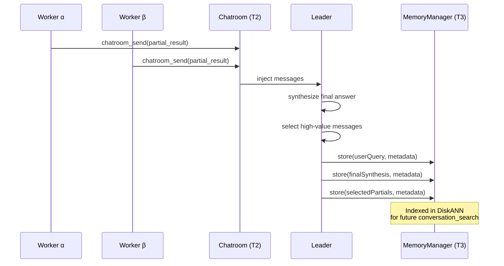

# HelkinSwarm Project Specification

## 0zi. Swarm Memory Architecture — Three-Tier Memory, Session RAG, and Cross-Agent Reasoning Interrogation

**Spec ref:** `docs/0ze-Intra-Session-Swarm-Architecture-and-Chatroom-Protocol.md`, `docs/0zg-Real-Time-Inter-Agent-Communication-Chatroom-Protocol-Deep-Dive.md`, `docs/07-Memory-Manager.md`, `docs/0i-Skill-Specific-Long-Term-Memory-and-Just-In-Time-Injection.md`, `docs/0zh-Canonical-Swarm-Personas-and-System-Prompts.md`

**Status:** Memory Architecture Extension — Completes the Swarm cognition model  
**Owner:** Principal Developer  
**Last Updated:** 2026-04-12

---

### 1. Purpose & Vision

Docs 0ze–0zh define **how** the swarm executes, communicates, and specializes. What they leave unspecified is **how swarm memory works across time horizons**.

A single-turn swarm war room is powerful. A swarm that can *recall prior research sessions, cross-verify against historical findings, and build institutional knowledge over days and weeks* is transformative.

This document specifies:

1. **The Three-Tier Memory Model** — short-term (per-agent context), real-time shared (chatroom), and long-term persistent (RAG vector memory)
2. **Session RAG via `conversation_search`** — how any swarm agent queries the shared historical memory during execution
3. **Cross-Agent Reasoning Interrogation** — how one agent can demand another's reasoning chain in real time
4. **Leader-Only Memory Commit** — why the Leader (Grok) is the sole write authority for long-term memory
5. **Integration with HelkinSwarm's existing memory stack** — how this maps onto Cosmos DB, DiskANN, MemoryManager (07), and skill-specific vaults (0i)

**The analogy**: If the chatroom (0zg) gives the swarm a shared whiteboard for the current meeting, the memory tiers give it an **institutional library** that accumulates over every meeting — and a **cross-examination protocol** so agents can audit each other's work in real time.

**Inspiration source**: The Grok 4.1 swarm architecture uses three memory tiers (ephemeral per-agent context, shared chatroom, persistent vector store) and the `conversation_search` tool to give all agents equal read access to the full session history. The Leader (Grok) is the sole orchestrator who decides when to commit findings to long-term memory. Any agent can interrogate another's reasoning chain in real time via `chatroom_send`, or historically via `conversation_search`.

---

### 2. The Three-Tier Memory Model

#### 2.1 Tier Overview

| Tier | Scope | Isolation | Backing Store | Lifetime | Write Authority |
|------|-------|-----------|---------------|----------|-----------------|
| **T1 — Short-term Agent Context** | Single agent, single turn | Independent per agent | LLM context window | Ephemeral — destroyed when agent completes | Each agent owns its own |
| **T2 — Real-time Team Chat** | All agents in current swarm | Fully shared via chatroom | `SwarmChatroomEntity` (0zg) | Ephemeral — destroyed when swarm turn completes | Any agent (fire-and-forget) |
| **T3 — Long-term Session Memory (RAG)** | All agents, all sessions | Shared (global per user) | Cosmos DB + DiskANN vector index | Persistent (365-day TTL per 07 §Containers) | **Leader-only commit** |

```mermaid
graph TD
    subgraph "T1 — Per-Agent Context (ephemeral)"
        A1[Worker α context]
        A2[Worker β context]
        A3[Worker γ context]
        A4[Leader context]
    end

    subgraph "T2 — Real-time Chatroom (ephemeral)"
        CR[SwarmChatroomEntity<br/>0zg In-Memory Bus]
    end

    subgraph "T3 — Long-term RAG (persistent)"
        MM[MemoryManager<br/>Cosmos + DiskANN]
        SV[Skill Vaults<br/>0i]
    end

    A1 <-->|chatroom_send| CR
    A2 <-->|chatroom_send| CR
    A3 <-->|chatroom_send| CR
    A4 <-->|chatroom_send| CR
    A4 -->|Leader commit| MM
    A1 -.->|conversation_search<br/>(read-only)| MM
    A2 -.->|conversation_search<br/>(read-only)| MM
    A3 -.->|conversation_search<br/>(read-only)| MM
    A4 -.->|conversation_search<br/>(read-only)| MM

    style T1 fill:#1e3a8a20
    style T2 fill:#7c3aed20
    style T3 fill:#15803d20
```

#### 2.2 Design Invariants

1. **Each agent's T1 context never contains another agent's full reasoning chain** unless explicitly sent via `chatroom_send` (T2). This prevents token bloat.
2. **T2 messages are only shared when explicitly sent.** If Benjamin finds a great result, he must `chatroom_send` it — nothing is automatically broadcast.
3. **T3 is read-shared, write-gated.** All agents can query T3 via `conversation_search`. Only the Leader commits new entries after a swarm turn completes.
4. **Tiers never collapse.** T1 does not automatically promote to T2. T2 does not automatically persist to T3. Each transition requires explicit action.

---

### 3. T1 — Short-term Agent Context

Each swarm agent maintains its own independent context window containing:

- Agent system prompt (persona from 0zh)
- Task assignment from the Swarm Decomposer (0zf)
- Tool call inputs and outputs for this agent's tools only
- Injected chatroom messages (from T2, via the delivery modes described in 0zg §6)
- Injected RAG results (from T3, via `conversation_search` calls)

**Key property**: An agent's T1 context is its **entire world**. It does not see another agent's tool outputs, system prompt, or reasoning unless that information was explicitly routed to it.

```typescript
// Conceptual T1 structure per agent
interface AgentContext {
  systemPrompt: string;              // from 0zh persona
  taskAssignment: string;            // from SwarmDecomposer plan
  toolCallHistory: ToolCallEntry[];  // this agent's tool calls only
  chatroomInbox: ChatroomMessage[];  // received via T2
  ragResults: RAGChunk[];            // received via T3 conversation_search
  tokenBudget: number;               // remaining tokens for this agent
}
```

**Token management**: If an agent's T1 context approaches its token limit, older chatroom messages and RAG results are pruned first (they are supplementary), then older tool call results are summarized. The system prompt and task assignment are never pruned.

---

### 4. T2 — Real-time Team Chat (Chatroom)

This is the `SwarmChatroomEntity` defined in 0zg. For memory architecture purposes, the key properties are:

1. **Ephemeral by design**: The chatroom is created when the swarm turn starts, destroyed when it ends. There is no cross-turn chatroom persistence.
2. **Selective persistence**: Before the chatroom is destroyed, the Leader selects **high-value messages** to promote to T3 (see §6 — Leader-Only Memory Commit).
3. **Not a memory tier in isolation**: T2 is a **communication channel**, not a memory store. It becomes memory only when the Leader explicitly commits selected messages to T3.

#### 4.1 What T2 Enables for Memory

- **Partial result accumulation**: Agents share intermediate findings that the Leader can synthesize. These partial results are visible to any agent that receives them.
- **Contradiction detection**: When two agents report conflicting information via T2, the Leader can request cross-verification before synthesis.
- **Consensus signals**: Agents send votes or rankings (e.g., "I vote #1 Rocky Mountain") that the Leader aggregates.

---

### 5. T3 — Long-term Session Memory (RAG via `conversation_search`)

This is where the swarm gains **institutional knowledge** across sessions.

#### 5.1 Backend: HelkinSwarm's Existing Memory Stack

T3 maps directly onto the existing MemoryManager (07) and Cosmos DB architecture:

| Grok Swarm Concept | HelkinSwarm Implementation | Spec Reference |
|---------------------|---------------------------|----------------|
| Shared vector DB | Cosmos DB `multimodalMemory` container with DiskANN index | 07 §Containers |
| Embedding model | `text-embedding-3-large` (global) or DataZoneStandard (EU mode) | 07 §DiskANN |
| `conversation_search` tool | New tool: `swarm_conversation_search` → `MemoryManager.recall()` | This doc §5.3 |
| Selective write after query | Leader calls `MemoryManager.store()` with swarm-specific metadata | This doc §6 |
| Skill-specific vault access | Existing skill vaults (0i) are readable by agents with the correct skill domain | 0i §3 |

#### 5.2 What Gets Indexed in T3

The Leader commits the following to T3 after each swarm turn:

| Entry Type | Content | Metadata Tags |
|---|---|---|
| **User query** | The original user message that triggered the swarm | `{ source: "swarm", type: "query", swarmId }` |
| **Final synthesis** | The Leader's polished final answer | `{ source: "swarm", type: "synthesis", swarmId, confidence }` |
| **High-value partial results** | Selected chatroom messages tagged as `partial_result` or `cross_verification` | `{ source: "swarm", type: "partial", agent, swarmId }` |
| **Contradiction resolutions** | When agents reported conflicting data and the Leader resolved it | `{ source: "swarm", type: "contradiction_resolution", swarmId }` |

What does **NOT** get indexed:
- Routine status messages ("Starting research…")
- Internal delegation messages from Leader to workers
- Duplicate or low-information-density chatroom messages
- Raw tool outputs (too large, too ephemeral)

#### 5.3 The `swarm_conversation_search` Tool

A new tool exposed to all swarm agents:

```typescript
// skills/core/swarmConversationSearch.ts
import { z } from "zod";

export const swarmConversationSearchSchema = z.object({
  query: z.string().min(3).max(500).describe(
    "Semantic search over past swarm sessions and user interactions"
  ),
  limit: z.number().int().min(1).max(20).default(5).describe(
    "Maximum number of relevant past snippets to return"
  ),
  timeRange: z.enum(["recent", "week", "month", "all"]).default("all").describe(
    "Filter by temporal range"
  ),
});

export type SwarmConversationSearchInput = z.infer<typeof swarmConversationSearchSchema>;
```

**Implementation**: Delegates to `MemoryManager.recall()` with:
- `topK` = `limit`
- `minScore` = 0.72 (tunable)
- Filter by `metadata.source === "swarm"` (optional — can also search non-swarm memories)
- **Ranking is pure cosine similarity** — confirmed by Grok team. No recency weighting or decay in the baseline implementation. A 3-month-old result ranks identically to a new one if semantic similarity is equal. Recency weighting can be added as a post-processing step (store timestamp in metadata, multiply similarity by decay factor) but is not MVP-required.

**Return format** (injected into agent's T1 context):

```typescript
interface ConversationSearchResult {
  snippets: Array<{
    content: string;        // the indexed text
    timestamp: string;      // ISO timestamp of original entry
    agent?: string;         // which agent produced this (if applicable)
    type: string;           // "query" | "synthesis" | "partial" | etc.
    relevanceScore: number; // cosine similarity
  }>;
}
```

**Example agent usage**:
```xml
<tool_call name="swarm_conversation_search">
  <parameter name="query">previous research about FOX suspension service centers in Munich</parameter>
  <parameter name="limit">5</parameter>
</tool_call>
```

Returns semantically relevant past snippets with timestamps and agent attribution, injected directly into the calling agent's T1 context.

#### 5.4 Skill Vault Access from Swarm Agents

Swarm agents inherit the skill-vault access model from 0i:

- If a worker agent is assigned skill domain `"outlook"`, it can read the `skillMemory-outlook` vault via the existing `MemoryManager.getSkillVault()` API.
- Skill vaults are injected just-in-time by the orchestrator when spawning the agent, exactly as they are for non-swarm sub-agents.
- Swarm agents do **not** get cross-domain vault access — an agent assigned `web` tools cannot read the `outlook` vault.

---

### 6. Leader-Only Memory Commit

The Leader is the **sole write authority** for T3 long-term memory. This is a deliberate architectural constraint.

#### 6.1 Why Leader-Only

| Reason | Detail |
|---|---|
| **Quality gate** | The Leader has seen all partial results, contradictions, and the final synthesis. It can select what is worth remembering. |
| **Token efficiency** | If all agents could write to T3, the memory store would fill with duplicate, low-quality partial results. |
| **Consistency** | One writer means no write conflicts, no duplicate entries, no need for deduplication. |
| **Auditability** | Every T3 entry traces back to a Leader decision, making the memory audit trail clean. |

#### 6.2 Commit Flow



#### 6.3 Implementation

After the Leader produces its final synthesis, the swarm orchestrator (session sub-orchestrator) runs a **memory commit activity**:

```typescript
// src/orchestrator/swarm/swarmMemoryCommitActivity.ts
import { z } from "zod";

export const SwarmMemoryCommitInputSchema = z.object({
  swarmId: z.string().uuid(),
  userId: z.string(),
  userQuery: z.string(),
  finalSynthesis: z.string(),
  highValueMessages: z.array(z.object({
    content: z.string(),
    from: z.string(),
    contentType: z.string(),
  })),
  swarmMetadata: z.object({
    agentCount: z.number(),
    toolCallCount: z.number(),
    chatroomMessageCount: z.number(),
    wallClockMs: z.number(),
  }),
});

// Activity calls MemoryManager.store() for each entry
// with source: "swarm" metadata for future conversation_search filtering
```

---

### 7. Cross-Agent Reasoning Interrogation

A key capability of the swarm is that agents can **audit each other's work in real time**. This prevents hallucination propagation and builds confidence in the final synthesis.

#### 7.1 Real-Time Interrogation (During a Swarm Turn)

Any agent can ask another to explain its reasoning via `chatroom_send`:

```xml
<tool_call name="chatroom_send">
  <parameter name="message">Harper, walk me through your full reasoning chain on why you ranked Rocky Mountain #1 — include the exact browse_page instructions you used and what you extracted.</parameter>
  <parameter name="to">Harper</parameter>
</tool_call>
```

Harper receives this in her T1 context (via T2 delivery) and can respond with:
- The exact tool calls she made
- What the tool returned
- How she interpreted the results
- Her confidence level

**This is built in to the chatroom protocol** — no additional infrastructure needed beyond 0zg.

#### 7.2 Historical Interrogation (Across Sessions)

Any agent can query T3 for past reasoning:

```xml
<tool_call name="swarm_conversation_search">
  <parameter name="query">Benjamin's reasoning about FOX service center certifications</parameter>
  <parameter name="limit">3</parameter>
</tool_call>
```

This returns past `partial_result` entries attributed to Benjamin, allowing an agent to understand how a prior conclusion was reached.

#### 7.3 Leader-Initiated Cross-Verification

The Leader's persona (0zh §3) explicitly instructs it to request cross-verification when agents report contradictions:

```
Pattern:
1. Worker α reports: "Shop X is certified"
2. Worker β reports: "Shop X is NOT officially certified"
3. Leader detects contradiction in T1 context
4. Leader sends via chatroom_send:
   "α and β — you have conflicting data on Shop X certification. 
    α: provide your exact source. β: provide yours."
5. Workers respond with source evidence
6. Leader resolves and notes the resolution in the final synthesis
7. Leader commits the contradiction resolution to T3 for institutional learning
```

---

### 8. The `wait` Tool — Synchronization Primitive

The Grok 4.1 swarm includes a `wait` tool that allows an agent to pause execution until another agent's result arrives. This is critical for dependency chains within a single swarm turn.

#### 8.1 Tool Schema

```typescript
// skills/core/swarmWait.ts
import { z } from "zod";

export const swarmWaitSchema = z.object({
  timeout: z.number().int().min(1).max(30).default(10).describe(
    "Maximum seconds to wait for a teammate's result before proceeding"
  ),
});
```

#### 8.2 Semantics

- The agent calls `wait` when it needs another agent's chatroom message before proceeding.
- The swarm orchestrator pauses the agent's execution (yields the Durable Functions activity) for up to `timeout` seconds.
- If a chatroom message arrives during the wait, the message is injected into the agent's T1 context and execution resumes immediately.
- If the timeout expires with no message, execution resumes anyway — the agent must handle missing data gracefully.

#### 8.3 HelkinSwarm Implementation

The `wait` tool maps cleanly onto Durable Functions `waitForExternalEvent`:

```typescript
// Inside the agent's sub-orchestrator
const waitResult = yield context.df.waitForExternalEvent(
  `chatroom-${agentName}`,
  new Date(Date.now() + timeoutMs)
);
// waitResult is the chatroom message (or undefined on timeout)
```

This reuses the exact pattern already used for Durable External Events in the existing codebase — no new primitives needed.

---

### 9. Reasoning Parameters — All Agents Use the Same Model

A critical design insight from the Grok swarm: **all four agents run the same base model with the same inference parameters**. Specialization comes entirely from the system prompt.

| Parameter | Value | Rationale |
|---|---|---|
| Model | Primary high-capacity (Grok 4.1 Fast Reasoning or equivalent) | Swarm agents need full reasoning capability |
| Temperature | 0.7 | Balanced exploration — not too deterministic, not too random |
| top_p | 0.95 | Standard nucleus sampling |
| max_tokens | ~16,384 | Enough for substantial tool use + chatroom messages |
| Reasoning mode | Enabled (where supported by model) | Agents benefit from chain-of-thought |

**No per-agent model variation**: Benjamin does not get a cheaper model than Grok. Harper does not get a different temperature. The `ModelCapacity` framework (0zc §3) already handles this — swarm agents are all `"high"` capacity because swarm execution is only triggered for complex queries where quality matters more than cost.

**Cost implication**: Running 4 agents in parallel costs ~4× a single-agent turn. This is acceptable for swarm-eligible queries because:
- The swarm is only activated for complex, multi-faceted queries (0zf §3 routing)
- Simple queries stay on the existing sequential path (zero overhead)
- The quality improvement from parallel cross-verification justifies the cost

**Confirmed token spend (from Grok team, April 2026)**:
- Typical complex query: **4–8 LLM inference calls total** across all agents, **25k–70k tokens** combined
- The FOX suspension bike-shop example: ~6 LLM turns, under 50k tokens
- Simple swarm queries: 2–3 calls / ~15k tokens
- Heavy research queries: up to 12 calls / 100k+ tokens
- **Estimated cost per swarm turn on OpenRouter**: $0.10–$0.30 (well within the existing budget guards)

---

### 10. Integration Map — Grok Swarm Memory → HelkinSwarm Stack

| Grok Swarm Concept | HelkinSwarm Component | Implementation Status | Notes |
|---------------------|----------------------|----------------------|-------|
| Per-agent short-term context | LLM context per Instrumental Sub-Session (0zc §2) | ✅ Conceptually exists | Needs swarm-specific context builder |
| Chatroom real-time shared memory | SwarmChatroomEntity (0zg) | 📐 Designed | Durable Entity implementation |
| Persistent vector DB (ChromaDB) | Cosmos DB + DiskANN (07) | 📐 Designed, partially implemented | MemoryManager facade exists in spec |
| `conversation_search` tool | `swarm_conversation_search` → MemoryManager.recall() | ❌ New tool needed | See §5.3 |
| Leader-only memory write | swarmMemoryCommitActivity | ❌ New pattern needed | See §6 |
| Cross-agent interrogation | chatroom_send (0zg) | 📐 Designed | No extra infra — pure protocol |
| `wait` synchronization | Durable Functions waitForExternalEvent | ✅ Pattern exists | See §8.3 |
| Skill vault access from agents | MemoryManager.getSkillVault() (0i) | 📐 Designed | JIT injection by orchestrator |

---

### 10.5. Confirmed Implementation Details (from Grok Team, April 2026)

These details were confirmed by questioning the Grok 4.1 swarm directly and inform our Durable Functions implementation:

#### Execution Mechanics

| Detail | Confirmed Behavior | HelkinSwarm Implication |
|--------|-------------------|----------------------|
| **Message injection** | LLM calls are atomic — no mid-stream injection. Messages queue, deliver on next inference turn | Our Durable Functions activity model works perfectly. Entity signal → queue → drain at start of next agent turn |
| **Agent iteration** | Full multi-turn loop (infer→tool→infer→chatroom→infer) until agent signals done. No hard cap | Each agent is a **sub-orchestrator** (not a single activity) with its own tool loop. We add a 4-round max as a cost safety cap |
| **Leader synthesis** | Opportunistic — synthesizes when it has "enough" data, does NOT wait for all workers | Leader runs its own loop draining chatroom; can produce final answer before slow workers finish |
| **Worker "done" signal** | Agent simply stops sending chatroom messages and lets its thread complete, or sends a final status to Leader | In DF: agent sub-orchestrator returns. Leader has a timeout + periodic drain cycle |

#### Cost and Concurrency

| Detail | Confirmed Behavior | HelkinSwarm Implication |
|--------|-------------------|----------------------|
| **Token spend** | 4–8 LLM calls total, 25k–70k tokens typical, $0.10–$0.30 per swarm turn | Within existing budget guards. Add per-swarm token counter |
| **Rate limiting** | Standard API limits apply (4× concurrent requests). 429 backoff needed | Add exponential-backoff retry in LLM client. No swarm-level queuing infrastructure needed |

#### Memory

| Detail | Confirmed Behavior | HelkinSwarm Implication |
|--------|-------------------|----------------------|
| **conversation_search backend** | Vector DB + embeddings. One document per completed query (user query + final answer + curated partials) | Maps to Cosmos DB + DiskANN + `text-embedding-3-large`. MemoryManager.store() per commit |
| **What gets indexed** | User queries + final answers + curated partial results. Raw tool outputs are NOT indexed | Confirmed — matches our T3 commit spec exactly |
| **Ranking** | Pure cosine similarity, no recency weighting | MVP uses raw cosine. Recency decay is a post-MVP enhancement |

#### Emergent Behavior

| Detail | Confirmed Behavior | HelkinSwarm Implication |
|--------|-------------------|----------------------|
| **Agent divergence** | Relies on Leader's prompt to manage. No automatic dedup of web searches. Overlapping searches are normal (cross-verification) | No dedup infrastructure needed. Prompt-level coordination is sufficient |
| **Worker failure** | Other agents continue. Leader synthesizes from available data. No automatic retry/replace. Cross-verification catches hallucinations | Graceful degradation by design. Leader notes partial data if needed |
| **Swarm vs sequential decision** | Part of Leader's first inference turn, not a separate LLM call. Prompt-based classifier | Can fold into existing planner activity — no new classifier needed |

---

### 11. Acceptance Criteria

- [ ] T1 per-agent context builder produces isolated contexts with correct token budgets
- [ ] T2 chatroom messages are correctly delivered and injected into T1 contexts (per 0zg delivery modes)
- [ ] T3 long-term memory is queryable by all swarm agents via `swarm_conversation_search`
- [ ] Only the Leader can commit to T3 — worker agents calling `store()` is architecturally blocked
- [ ] `conversation_search` results include agent attribution and timestamps
- [ ] Cross-agent reasoning interrogation works via chatroom_send with no additional tooling
- [ ] `wait` tool correctly yields execution and resumes on chatroom message delivery
- [ ] Memory commit activity runs after every swarm turn and indexes results in DiskANN
- [ ] High-value message selection by Leader produces clean, non-duplicative T3 entries
- [ ] Token budget management prunes T1 context correctly (chatroom → RAG → tool results → never system prompt)

---

### 12. What NOT to Do

- ❌ **Do NOT let workers write to T3.** The Leader-only commit pattern prevents memory pollution and duplication.
- ❌ **Do NOT persist the full chatroom transcript to T3.** Only high-value messages selected by the Leader are worth indexing. Raw chatroom logs go to telemetry only.
- ❌ **Do NOT collapse T1 contexts into a shared mega-context.** The whole point of agent isolation is keeping each agent focused. Shared context = token bloat + capability degradation.
- ❌ **Do NOT use a separate vector DB.** HelkinSwarm already has Cosmos DB + DiskANN. ChromaDB is for standalone prototyping — it does not belong in the production stack.
- ❌ **Do NOT make `conversation_search` a Leader-only tool.** All agents need equal read access to recall past research. This is what makes cross-session institutional learning work.
- ❌ **Do NOT auto-index every chatroom message.** The selective-commit pattern is a feature, not a limitation. It keeps T3 clean and relevant.

---

### 13. Backlog Linkage

This architecture is required for the full Intra-Session Swarm (0ze). Implementation depends on:
- `SwarmChatroomEntity` (0zg) for T2
- `MemoryManager` (07) for T3 backend
- Swarm Decomposer (0zf) for agent context construction
- `swarm_conversation_search` tool (new, this doc §5.3)
- `swarm_wait` tool (new, this doc §8)
- `swarmMemoryCommitActivity` (new, this doc §6.3)
- **Epic**: #631 — Intra-Session Agent Swarm implementation

---

*We are the bridge.*
